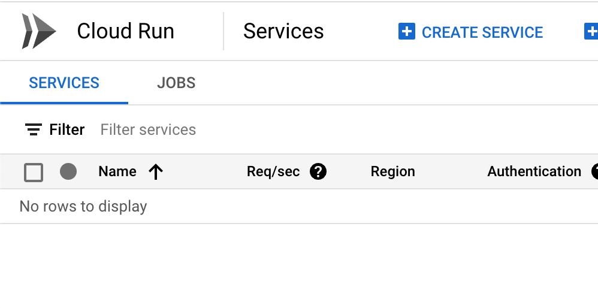

## <COEN6313: Programming On Cloud> TUT: Google Cloud Run

This tutorial will go through two demo projects using Google Cloud Run.

Before you dive into the coding, you should study the following materials. No need to actually operate on the Cloud Run.

- Overall:

  - [What is Cloud Run](https://cloud.google.com/run/docs/overview/what-is-cloud-run): You should understand the concept of "Cloud Run Services" and "Clould Run Jobs."

  - [Is my app a good fit for Cloud Run?](https://cloud.google.com/run/docs/fit-for-run): You should know what kind of work suits Google Cloud Run.

- Cloud Run Services:

  - [Quickstart: Deploy to Cloud Run from a Git Repository](https://cloud.google.com/run/docs/quickstarts/deploy-continuously#cloudrun_deploy_continuous_code-python)

  - [Deploy a Python Service to Cloud Run from Source Code](https://cloud.google.com/run/docs/quickstarts/build-and-deploy/deploy-python-service)

## Preliminary Setup

1. Create a Project Space for your work at https://cloud.google.com/?hl=en.

2. Install the Google Cloud CLI: https://cloud.google.com/sdk/docs/install, run init, and select the project you just created.

3. (Optional) Install docker in your local to debug with your Dockerfile.

## Cloud Run Services

There are three approaches to deploying your project to Cloud Run: (1) from a published docker image, (2) from a GitHub repository, and (3) from your local source code.

In this tutorial, we will walk through the last two approaches.

### Deploy from a Git Repository

We can deploy our project on GitHub to Cloud Run and leverage the CI/CD of it.

1. Clone this repo;

2. Go to Cloud Run and create a service.

   

3. Select "... from a source repository"; Setup Cloud Build; Authorize to your GitHub account; Select the repo you just cloned;

   

   Select the main branch; Select build type "Dockerfile" and locate the file.

   

   Allow unauthenticated invocations and create it;
   

4. Your code now is created and deploying on Cloud Run;

   

5. Visit the URL;

   

6. Make some changes in your code and commit it to the GitHub repo;
   

7. Visit the Build History. You should see a new build is processing;

   

8. The change should be updated to the web service;

   


### Deploy from Local Source Code using Google Cloud CLI

Sometimes, you need to deploy your local work to the cloud for debugging. One simple way is to deploy your code using Google Cloud CLI.

In this repo, we have a Java application demo in `skier_app_java`.

Once you have installed the CLI tools, you now can deploy this project with:

``` bash
cd ./skier_app_java
```

and run:

``` bash
gcloud run deploy 
```

Follow the prompt: (1) stay default for source code location; (2) stay default for service name; (3) select region; (4) allow unauthenticated invocations.


This will trigger the Cloud Build first to build your image:


Then, it will create a Cloud Run Service:


You can now visit the [<your_cloudrun_service_url>/coen6731/public/]() to play with the Java Web application.


To deploy your changes on local, you can simply just run the `gcloud run deploy ` again.
