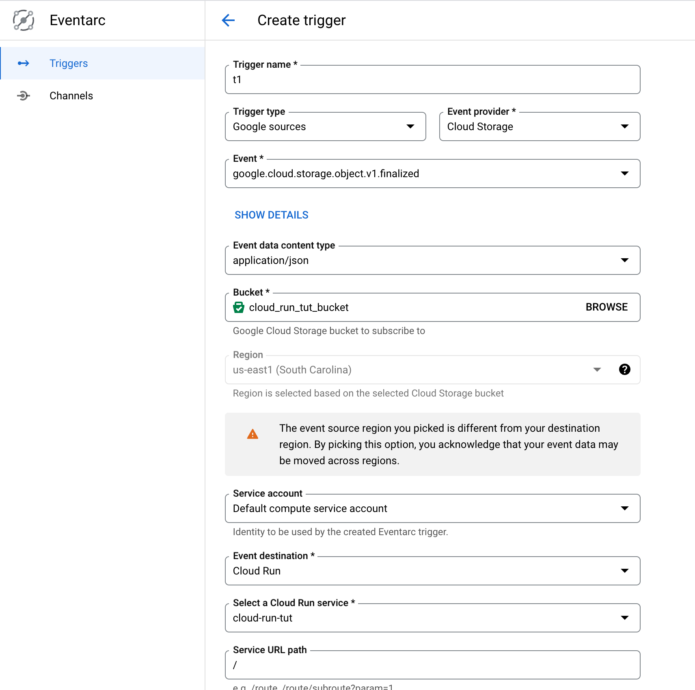
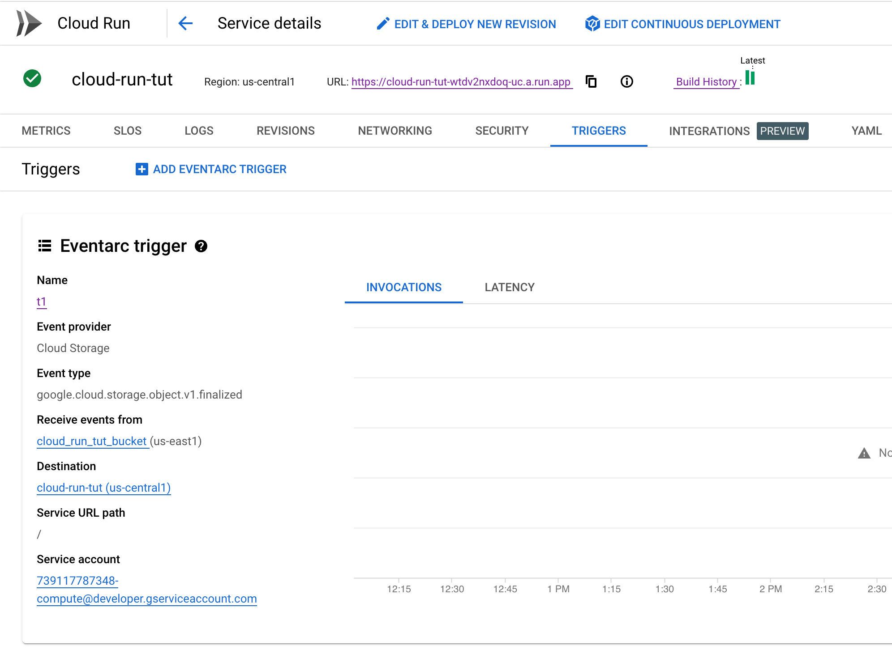

## <COEN6313: Programming On Cloud> TUT: Google Cloud Run

This tutorial will go through three demo projects for two use cases using Google Cloud Run.

This tutorial showcases two use cases: (1) [Web services: Websites](https://cloud.google.com/run/#section-6) and  (2) [Data processing: Lightweight data transformation]( https://cloud.google.com/run/#section-6).


Before you dive into the coding, you should study the following materials. No need to operate on the Cloud Run.

- Cloud Run:

  - Overall:
    - [What is Cloud Run](https://cloud.google.com/run/docs/overview/what-is-cloud-run): You should understand the concept of "Cloud Run Services" and "Clould Run Jobs."

    - [Is my app a good fit for Cloud Run?](https://cloud.google.com/run/docs/fit-for-run): You should know what kind of work suits Google Cloud Run.

  - For Use Case 1:
    - [Quickstart: Deploy to Cloud Run from a Git Repository](https://cloud.google.com/run/docs/quickstarts/deploy-continuously#cloudrun_deploy_continuous_code-python)

    - [Deploy a Python Service to Cloud Run from Source Code](https://cloud.google.com/run/docs/quickstarts/build-and-deploy/deploy-python-service)

  - For Use Case 2:
    - [Use Eventarc to receive events from Cloud Storage](https://cloud.google.com/run/docs/tutorials/eventarc)

- Cloud Storage:
  - [Discover object storage with the Google Cloud console](https://cloud.google.com/storage/docs/discover-object-storage-console)
  - [About Cloud Storage buckets](https://cloud.google.com/storage/docs/buckets)
- Eventarc:
  - [Eventarc overview](https://cloud.google.com/eventarc/docs/overview)


## Preliminary Setup

1. Create a Project Space for your work at https://cloud.google.com/?hl=en.

2. Install the Google Cloud CLI: https://cloud.google.com/sdk/docs/install, run init, and select the project you just created.

3. Enable Google Cloud APIs:

   ``` bash
   gcloud services enable run.googleapis.com \
       eventarc.googleapis.com \
       storage.googleapis.com \
       cloudbuild.googleapis.com
   ```

   

4. (Optional) Install docker in your local to debug with your Dockerfile.


## Use Case 1: Web Application

There are three approaches to deploying your project as services to Cloud Run: (1) from a published docker image, (2) from a GitHub repository, and (3) from your local source code.

This tutorial walks through the last two approaches.

### Deploy from a Git Repository

Deploying projects on GitHub to Cloud Run can enable the CI/CD workflow between Google Cloud Platform and GitHub. Please work on the following steps:

1. Clone this repo.

2. Go to Cloud Run and click Create.

3. Select "... from a source repository"; Setup Cloud Build; Authorize to your GitHub account; Select the repo you just cloned.

   

   Select the main branch; Select build type "Dockerfile" and locate the file.

   

   Allow unauthenticated invocations and create the service.

   

4. Your code is now created and deployed on Cloud Run.

   

5. Visit the URL.

   

6. Make some changes in your code and commit it to the GitHub repo.

   

7. Visit the Build History. You should see a new build is processing.

   

8. The change should be updated to the web service.

   


### Deploy from Local Source Code using Google Cloud CLI

Sometimes, you may want to deploy your local work to the cloud for debugging. One simple way is to deploy your code using **Google Cloud CLI**.

This repo also contains a Java application demo in `skier_app_java`. To deploy its code, a `Dockerfile` is necessary. 

The file builds an image that runs a Java application with Maven.

``` dockerfile
FROM maven:3.9.4-eclipse-temurin-11


COPY . ./project
WORKDIR ./project

EXPOSE 8080
ENTRYPOINT ["mvn", "clean", "install", "exec:exec", "-Dmaven.test.skip=true"]
```


Once you have installed the CLI tools, you can now deploy this project with the following:

``` bash
cd ./skier_app_java
```

And run:

``` bash
gcloud run deploy 
```

Follow the prompt: (1) stay default for source code location; (2) stay default for service name; (3) select region; (4) allow unauthenticated invocations.


This will trigger the Cloud Build first to build your image:


Then, it will create a Cloud Run Service:


You can now visit the [<your_cloudrun_service_url>/coen6731/public/]() to play with the Java Web application.


To continually deploy your local changes, you can rerun the `gcloud run deploy` and use the same service name.


## Use Case 2: Automated Data Transformation

To implement the use case, the basic process would be like https://cloud.google.com/eventarc/docs/run/create-trigger-storage-console. But you need to have your event receiver that receives the file upload events and hand it to BigQuery.

Before that, you need to know how the event has been received and what you will receive.

Use the Python app of case 1 to reveal that. Change the code of `main.py`

``` python
@app.route("/", methods=['GET', 'POST'])
def hello_world():
    """Example Hello World route."""

    // print out the data
    print(request.method)
    print(request.data)
    
    return f"Hello World!!!@@@!!!"
```

And deploy it.

Then, create a bucket:


After that, create an Eventarc trigger:



For the event type, you should select the following option since uploading a file creates a new object to the bucket:


Once it's created, you can find it in the Cloud Run Service page:



Upload one PNG file to the bucket, and then you can get the following message from the LOGS of the service.


Now you know what is the incoming request from Eventarc.

Program the Python application to get the uploaded file and store it in the BigQuery. You will do it by using the API Client Libraries:

- [BigQuery API Client Libraries](https://cloud.google.com/bigquery/docs/reference/libraries)
- [Loading CSV data from Cloud Storage](https://cloud.google.com/bigquery/docs/loading-data-cloud-storage-csv)
- [Cloud Storage Client Libraries](https://cloud.google.com/storage/docs/reference/libraries) (optional)

Before using these libraries, you must set up the authentication: https://cloud.google.com/docs/authentication/client-libraries. If the code runs on Google Cloud Run, it is set by default, and no action is needed. But if the code runs locally, follow https://cloud.google.com/docs/authentication/provide-credentials-adc#local-dev by just:

``` bash
gcloud auth application-default login
```


There are many ways you could do the loading. One way is to use the Storage Client Libraries to download and upload the file with the BigQuery Client Libraries. The other way is to use the BigQuery Client Libraries to create the table directly from a Cloud Storage URL (starts with `gs://`). 

Please read:

- [Loading data from Cloud Storage](https://cloud.google.com/bigquery/docs/batch-loading-data#permissions-load-data-from-cloud-storage).
- [Loading CSV data into a table](https://cloud.google.com/bigquery/docs/loading-data-cloud-storage-csv#loading_csv_data_into_a_table)

The following scenario is presented: We upload the IRIS dataset to the bucket with Console, and we should be able to query all its data in BigQuery.

Then the HelloWorld API is modified to:

``` python
from google.cloud import bigquery

@app.route("/", methods=['GET', 'POST'])
def hello_world():
    """Example Hello World route."""

    # print(request.method)
    # print(request.data)
    
    payload = json.loads(request.data)
    print(payload)
    file_name = payload['name']
    bucket_name = payload['bucket']
    
    # Construct a BigQuery client object.
    client = bigquery.Client()

    # TODO(developer): Set table_id to the ID of the table to create.
    # table_id = "your-project.your_dataset.your_table_name"
    table_id = f"cloud-tut-397400.cloud_run_tut_dataset.iris"

    job_config = bigquery.LoadJobConfig(
        schema=[
            bigquery.SchemaField("Id", "INT64"),
            bigquery.SchemaField("SepalLengthCm", "FLOAT64"),
            bigquery.SchemaField("SepalWidthCm", "FLOAT64"),
            bigquery.SchemaField("PetalLengthCm", "FLOAT64"),
            bigquery.SchemaField("PetalWidthCm", "FLOAT64"),
            bigquery.SchemaField("Species", "STRING"),
        ],
        skip_leading_rows=1,
        # The source format defaults to CSV, so the line below is optional.
        source_format=bigquery.SourceFormat.CSV,
    )
    uri = f"gs://{bucket_name}/{file_name}"

    load_job = client.load_table_from_uri(
        uri, table_id, job_config=job_config
    )  # Make an API request.

    load_job.result()  # Waits for the job to complete.

    destination_table = client.get_table(table_id)  # Make an API request.
    print("Loaded {} rows.".format(destination_table.num_rows))
    
    return f"Hello World!!!@@@!!!"
```


Create a table named `cloud_run_tut_dataset` in BigQuery.


Note that the `table_id` strictly follows the format `your-project.your_dataset.your_table_name`.

The `your-project` is replaced with the project ID, which can be found while selecting Project in the Console. You may also use the project name.


The `your_dataset` is replaced with the dataset name.

The `your_table_name` is the only term we could decide. In this case, it is `iris`.

Now, you can upload the `Iris.csv` file in this repo to the bucket.


Go to the LOGS of the service. The payload and the number of rows are printed.


