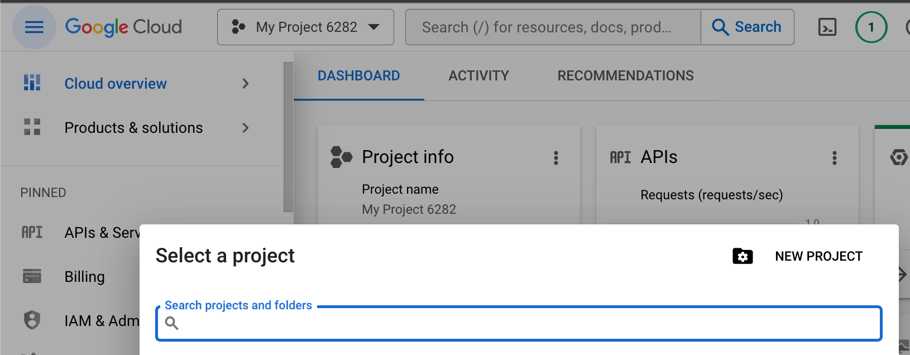
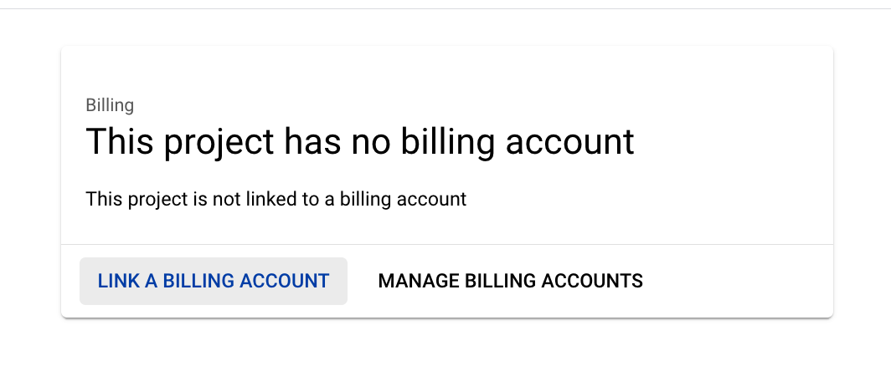
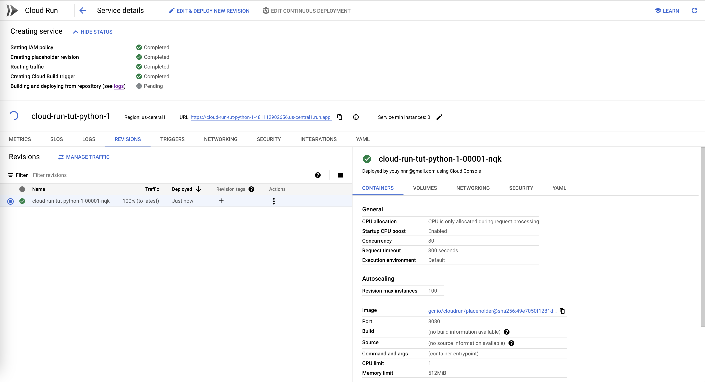
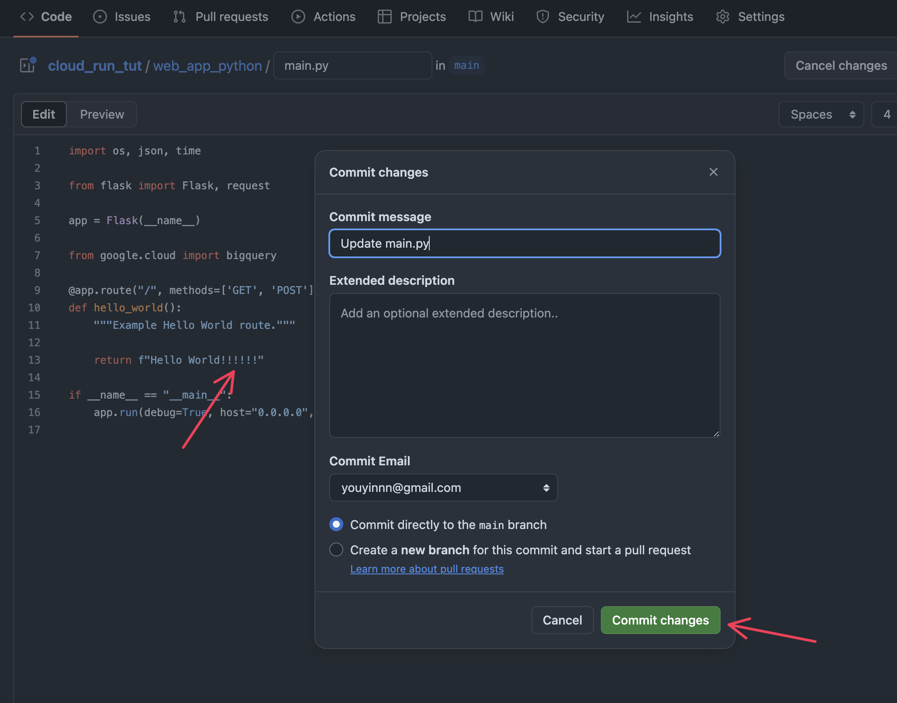
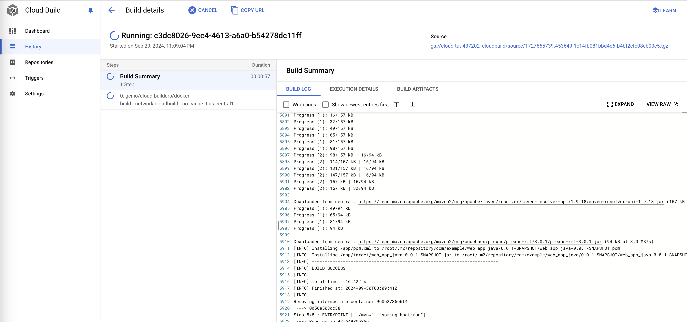
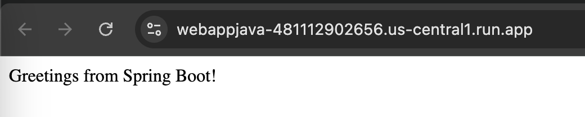

# <COEN6313: Programming On Cloud> TUT: Google Cloud Run

This tutorial will go through three demo projects for two use cases:

1. [Websites and web applications](https://cloud.google.com/run/#websites-and-web-applications);
2. [Streaming data processing](https://cloud.google.com/run/?hl=en#streaming-data-processing);

using **Google Cloud Run**, **Cloud Storage**, **Eventarc (pronunciation: event arch)**, and **BigQuery** services of the Google Cloud Platform.

# 1. Readings

Before you dive into the coding, you should study the following materials.

There is no need to operate on the Cloud Run; understand the concepts and know what you will do.

- How to use Git and Github: [Youtube: Git Tutorial](https://www.youtube.com/watch?v=8JJ101D3knE&t=3s), [Youtube: GitHub Tutorial](https://www.youtube.com/watch?v=tRZGeaHPoaw).

## 1.1 Case 1: Cloud Run Basic

- Overall:

  - [What is Cloud Run](https://cloud.google.com/run/docs/overview/what-is-cloud-run)? You should understand the concepts of "Cloud Run Services" and "Cloud Run Jobs."

  - [Is my app a good fit for Cloud Run?](https://cloud.google.com/run/docs/fit-for-run) You should know what kind of work suits Google Cloud Run.

- For Use Case 1:

  - [Quickstart: Deploy to Cloud Run from a Git Repository](https://cloud.google.com/run/docs/quickstarts/deploy-continuously#cloudrun_deploy_continuous_code-python)

  - [Deploy a Python Service to Cloud Run from Source Code](https://cloud.google.com/run/docs/quickstarts/build-and-deploy/deploy-python-service)

## 1.2 Case 2: Cloud Run + Cloud Storage

- For Use Case 2:
  - [Use Eventarc to receive events from Cloud Storage](https://cloud.google.com/run/docs/tutorials/eventarc)
- Cloud Storage:
  - [Discover object storage with the Google Cloud console](https://cloud.google.com/storage/docs/discover-object-storage-console)
  - [About Cloud Storage buckets](https://cloud.google.com/storage/docs/buckets)
- Eventarc:
  - [Eventarc overview](https://cloud.google.com/eventarc/docs/overview)
- BigQuery:
  - [What is BigQuery](https://cloud.google.com/bigquery/docs/introduction)

# 2. Preliminary Setup

1. Install the Google Cloud CLI: https://cloud.google.com/sdk/docs/install, run init, and select the project you just created.

   Verify if the tools by the command:

   ```bash
   gcloud -v
   ```

   and you should get the following output:

   ```bash
   Google Cloud SDK 444.0.0
   bq 2.0.97
   core 2023.08.22
   gcloud-crc32c 1.0.0
   gsutil 5.25
   ```

2. Create your Project on Google Cloud Console at https://cloud.google.com/?hl=en.

   

3. **<<IMPORTANT>>**: **Set up a billing account for your project**.

   

   If you are new to the platform, remember that the platform grants you $400+ credits once your billing is linked.

4. Authorization for the gcloud.

   You should log in first:

   ```bash
   gcloud auth login
   ```

   then it will pull up your browser:

   

   Once allowed, you will see:

   

   Verify your login status with:

   ```bash
   gcloud auth list
   ```

   You should be able to see the following messgae:

   ```bash
       Credentialed Accounts
   ACTIVE  ACCOUNT
           bbbb@concordia.ca
   *       xxxxx@gmail.com

   To set the active account, run:
       $ gcloud config set account `ACCOUNT`
   ```

5. Config the project to your gcloud:

   ```bash
   gcloud config set project <your-project-id>
   ```

   The project ID can be found while selecting Project in the Console.

   

6. Set up Billing information and add a payment to your account (this will charge you refundable 1\$~2\$):

   

7. Then, use the `gcloud` in your machine to enable the following **six** Google Cloud APIs (Updated):

   ```bash
   gcloud services enable run.googleapis.com eventarc.googleapis.com storage.googleapis.com cloudbuild.googleapis.com iam.googleapis.com iamcredentials.googleapis.com
   ```

   You should be able to see the following message:

   ```bash
   Operation "operations/acf.xxxxxxxxx" finished successfully.
   ```

8. (Optional) Install docker in your local to debug with your Dockerfile.

# 3. Use Case 1: Websites and web applications

There are three approaches to deploying your project as services to Cloud Run:

1. from a published docker image;
2. <u>from a GitHub repository;</u>
3. <u>from a local source code;</u>

> **<u>The following user scenario is presented</u>**:
>
> You now work on deploying two web applications (one Python and one Java) to the Google **<u>_Cloud Run_</u>** through the last two approaches.

## 3.1 Approach 1: Deploy from a Git Repository

Deploying projects on GitHub to Cloud Run can enable the CI/CD workflow between Google Cloud Platform and GitHub.

In the `web_app_python` of this repository, a simple Flash application in the `main.py` and the `Dockerfile` is for Cloud Run Service to build and deploy the image.

The `Dockerfile`:

```dockerfile
# Use the official lightweight Python image.
# https://hub.docker.com/_/python
FROM python:3.11-slim

# Allow statements and log messages to immediately appear in the logs
ENV PYTHONUNBUFFERED True

# Copy local code to the container image.
ENV APP_HOME /app
WORKDIR $APP_HOME
COPY . ./

# Install production dependencies.
RUN pip install --no-cache-dir -r requirements.txt

# Run the web service on container startup. Here we use the gunicorn
# webserver, with one worker process and 8 threads.
# For environments with multiple CPU cores, increase the number of workers
# to be equal to the cores available.
# Timeout is set to 0 to disable the timeouts of the workers to allow Cloud Run to handle instance scaling.
CMD exec gunicorn --bind :$PORT --workers 1 --threads 8 --timeout 0 main:app

```

In this section, you will focus on the `/` endpoint in the `main.py`:

```python
@app.route("/", methods=['GET', 'POST'])
def hello_world():
    """Example Hello World route."""

    return f"Hello World!!!@@@!!!"
```

Please work on the following steps:

1. Clone this repository ([Youtube: Git Tutorial](https://www.youtube.com/watch?v=8JJ101D3knE&t=3s), [Youtube: GitHub Tutorial](https://www.youtube.com/watch?v=tRZGeaHPoaw)).

2. Go to Cloud Run and create a Cloud Run Service:

   1. Click the Cloud Run panel "CREATE SERVICE."

   2. Follow the screenshot:

      1. Select "... from a source repository";

      2. Setup Cloud Build;

      3. Select GitHub as the provider;

      4. Authorize your GitHub account;

      5. Select the repository you just cloned;

      6. Install the Google Cloud Build to your repo;

      

   3. Select the main branch; Select build type "Dockerfile" and locate the file path `/Dockerfile`.

      

   4. Allow unauthenticated invocations and create the service.

      

3. Your code is now created and deployed on Cloud Run.

   

4. Visit the URL of the `hello_world()` endpoint.

   

5. Make some changes in your code and commit it to the GitHub repository.

   We remove the @@@ in the code.

   

6. Visit the Build History. You should see a new build is processing.

   

7. The change should be updated to the web service.

   

## 3.2 Approach 2: Deploy from Local Source Code using Google Cloud CLI

Sometimes, you may want to deploy your local work to the cloud for debugging.

One simple way is to deploy your code using **Google Cloud CLI**.

In the root path of this repository, a Java application demo in the folder `web_app_java` contains all necessary Java servlet code and the `web_app_java/Dockerfile`.

The file builds an image that runs a Java application with Maven.

This is the `Dockerfile`:

```dockerfile
FROM maven:3.9.4-eclipse-temurin-17

WORKDIR ./app
COPY . .

RUN ["mvn", "clean", "install", "-Dmaven.test.skip=true"]

ENTRYPOINT ["./mvnw", "spring-boot:run"]
```

And a simple controller in `src/main/java/com/example/web_app_java/controller/HelloController.java`:

```java
@RestController
public class HelloController {

    @GetMapping("/")
    public String index() {
        return "Greetings from Spring Boot!";
    }

}
```

Please work on the following steps:

1. Once you have installed the CLI tools, you can now deploy this project with the following:

   ```bash
   cd ./web_app_java
   ```

   And run:

   ```bash
   gcloud run deploy
   ```

2. Follow the prompt: (1) stay default for source code location; (2) stay default for service name; (3) select region; (4) allow unauthenticated invocations.

   

   This will trigger the Cloud Build first to build your image. On the Cloud Build, you will see:

   

   Then, it will create a Cloud Run Service. On the Cloud Run, you will see your endpoint URL:

   

   You can now visit the URL.

   

To continually deploy your local changes, you can re-run the `gcloud run deploy` and use the same service name.

# 4. Use Case 2: Streaming data processing

To implement the use case, the basic process would be like https://cloud.google.com/eventarc/docs/run/create-trigger-storage-console. But you need to have your **<u>event receiver</u>** that receives the file upload events and hand it to BigQuery. <u>**We deploy a web application with Cloud Run as the receiver.**</u>

> **<u>The following user scenario is presented</u>**:
>
> We upload the IRIS dataset to the **_<u>Cloud Storage</u>_** bucket with the Console.
>
> We deploy a **<u>_Cloud Run_</u>** service which listens to the upload event and transfers all data in the IRIS.csv file to the **<u>_BigQuery_</u>** table automatically.

## 4.1 Find Out What the Event Message Looks Like

Before that, you need to know <u>how the event has been received and what you will receive</u>.

The following process shows how to figure out the event.

Use the Python app of case 1 to reveal that by adding the following endpoint `event_looks` to the web app on `main.py` as the **<u>event receiver</u>**.

```python
@app.route("/event_looks", methods=['POST'])
def event_looks():
    print(request.method)
    payload = json.loads(request.data)
    print(payload)

    return "Event Received"
```

1. Deploy it to the Cloud Run as we did in use case 1.
2. Create a **<u>_Cloud Storage_</u>** bucket named `cloud_run_tut_bucket`:

   

3. Create an Eventarc trigger named `t1`, select the following event type, link it to the `cloud_run_tut_bucket` storage and the `cloud_run_tut` Run service of endpoint `/event_looks` :

   

   For the event type, you should select the following option since uploading a file creates a new object to the bucket:

   

   Once the trigger is created, you can find it on the Cloud Run Service page:

   

4. Upload one PNG file to the bucket, and then you can get the following message from the LOGS of the service.

   

   Now you know what is the incoming request from Eventarc.

## 4.2 Receive Events for Data Transformation

Program the Python application to get the uploaded file and store it in the BigQuery by using the API Client Libraries:

- [BigQuery API Client Libraries](https://cloud.google.com/bigquery/docs/reference/libraries)
- [Loading CSV data from Cloud Storage](https://cloud.google.com/bigquery/docs/loading-data-cloud-storage-csv)
- [Cloud Storage Client Libraries](https://cloud.google.com/storage/docs/reference/libraries) (optional)

Before using these libraries, you must set up the authentication: https://cloud.google.com/docs/authentication/client-libraries. If the code runs on Google Cloud Run, it is set by default, and no action is needed.

But if the code runs locally, follow https://cloud.google.com/docs/authentication/provide-credentials-adc#local-dev by just:

```bash
gcloud auth application-default login
```

There are many ways you could do the loading. One way is to use the Storage Client Libraries to download and upload the file with the BigQuery Client Libraries. The other way is to use the BigQuery Client Libraries to create the table directly from a Cloud Storage URL (starts with `gs://`).

Please read:

- [Loading data from Cloud Storage](https://cloud.google.com/bigquery/docs/batch-loading-data#permissions-load-data-from-cloud-storage).
- [Loading CSV data into a table](https://cloud.google.com/bigquery/docs/loading-data-cloud-storage-csv#loading_csv_data_into_a_table)

The `main.py` already has the demo code as endpoint `/event_receive`.

```python
@app.route("/event_receive", methods=['POST'])
def event_receiver():
    payload = json.loads(request.data)

    file_name = payload['name']
    bucket_name = payload['bucket']

    # Construct a BigQuery client object.
    client = bigquery.Client()

    # TODO(developer): Set table_id to the ID of the table to create.
    # the format of the table id is:
    # table_id = "your-project.your_dataset.your_table_name"
    # for example, mine was:
    table_id = f"cloud-tut-397400.cloud_run_tut_dataset.iris"

    job_config = bigquery.LoadJobConfig(
        schema=[
            bigquery.SchemaField("Id", "INT64"),
            bigquery.SchemaField("SepalLengthCm", "FLOAT64"),
            bigquery.SchemaField("SepalWidthCm", "FLOAT64"),
            bigquery.SchemaField("PetalLengthCm", "FLOAT64"),
            bigquery.SchemaField("PetalWidthCm", "FLOAT64"),
            bigquery.SchemaField("Species", "STRING"),
        ],
        skip_leading_rows=1,
        # The source format defaults to CSV, so the line below is optional.
        source_format=bigquery.SourceFormat.CSV,
    )
    uri = f"gs://{bucket_name}/{file_name}"

    load_job = client.load_table_from_uri(
        uri, table_id, job_config=job_config
    )  # Make an API request.

    load_job.result()  # Waits for the job to complete.

    destination_table = client.get_table(table_id)  # Make an API request.
    print("Loaded {} rows.".format(destination_table.num_rows))

    return "Event Received"
```

1. Create a BigQuery dataset named `cloud_run_tut_dataset` in BigQuery.

   

2. Please replace the `table_id` inside the endpoint `/event_receive` to your case.

   Note that the `table_id` strictly follows the format `your-project.your_dataset.your_table_name`.

   - The `your-project` is replaced with the project ID, which can be found while selecting Project in the Console. You may also use the project name.

     

   - The `your_dataset` is replaced with the dataset name.

   - The `your_table_name` is the only term we could decide. In this case, it is `iris`.

3. Then, create a new Eventarc trigger for the endpoint `/event_receive` on the Cloud Run service's TRIGGER panel, similar to what we did before: 

4. Now, you can upload the `Iris.csv` file in this repository to the bucket.

   

   Go to the LOGS of the service. The payload and the number of rows are printed.

   

5. Finally, you can query the iris data from the created table in BigQuery:

   
